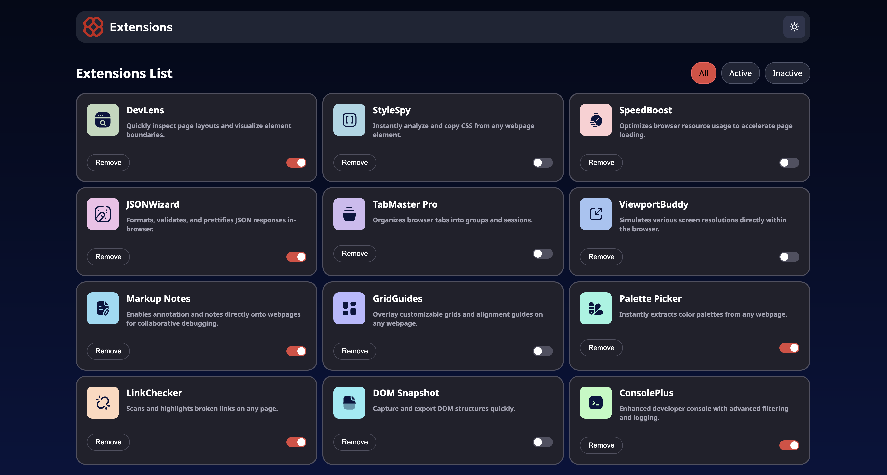
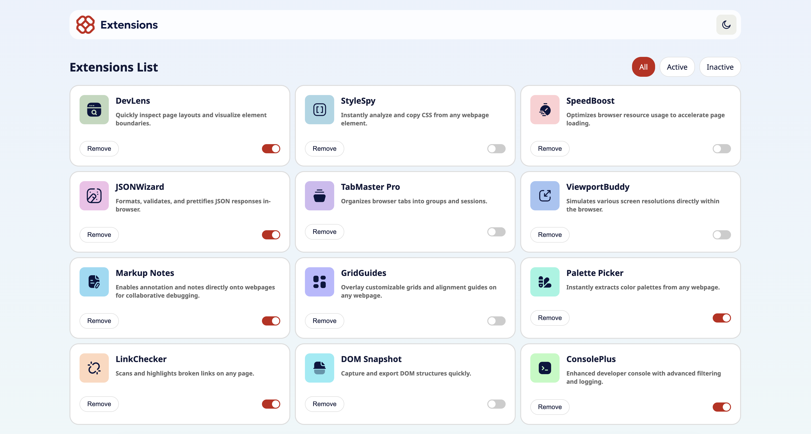
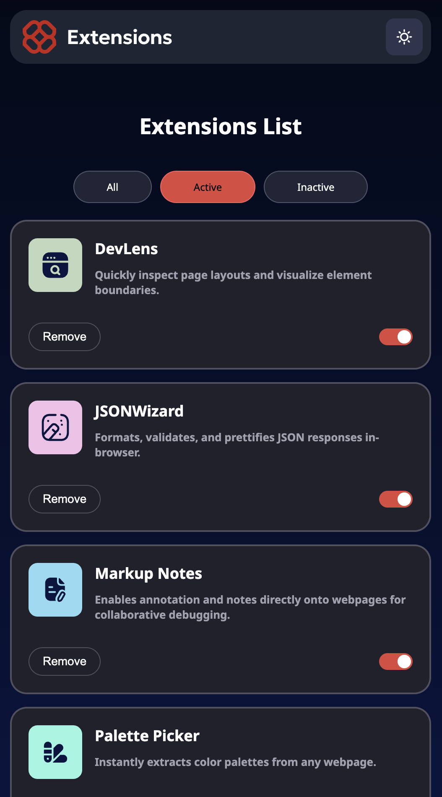
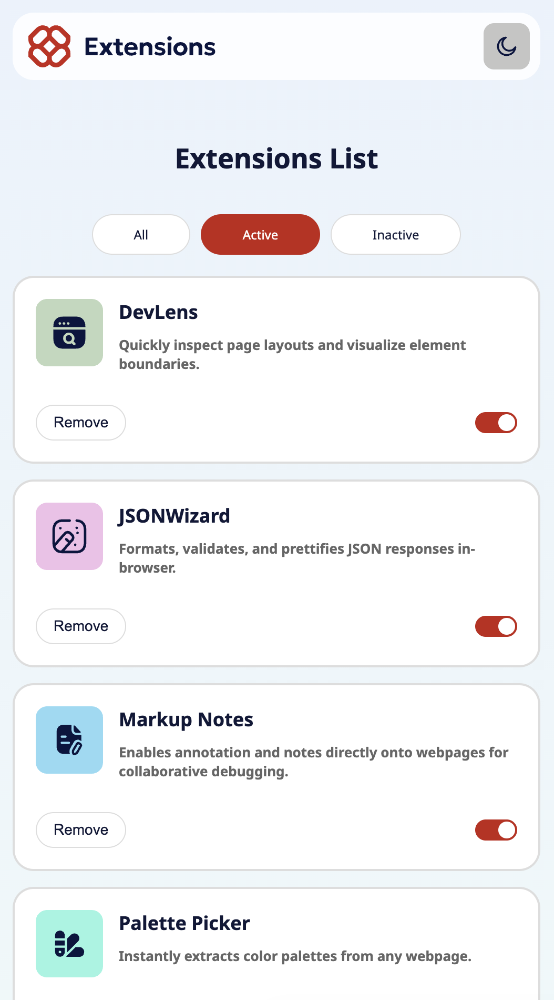

# Browser Extension Manager UI

This project is a solution to the [Frontend Mentor - Browser Extension Manager UI Challenge](https://www.frontendmentor.io/challenges/browser-extension-manager-ui-yNZnOfsMAp).  
The goal was to build a modern, fully responsive browser extension management interface.

---

## 🔗 Live Preview

👉 [Live Preview](https://umutyavyz.github.io/Frontend-Mentor-Browser-Extension-Manager-UI/)

---

## 📸 Screenshots

### Desktop Design

**Dark Mode**  

**Light Mode**  

### Mobile Design

**Dark Mode**  

**Light Mode**  

---

## 🛠️ Technologies Used

- HTML5
- Tailwind CSS
- JavaScript (ES6+)
- Responsive Design (Mobile, Tablet, Desktop)
- Git & GitHub
- [Frontend Mentor](https://www.frontendmentor.io/)

---

## ✨ Features

- **Fully Responsive Design**: Works seamlessly across mobile, tablet, and desktop.  
- **Dark & Light Mode Support**: Switch between themes based on user preference.  
- **Interactive UI**: Buttons and menus with hover and focus states.  
- **Category & Extension Management**: Clean UI for managing browser extensions.  
- **User-Friendly**: Clear information hierarchy and accessible design.  

---

## 💡 What I Learned

- Designing a fully responsive interface with mobile-first approach.  
- Implementing dark and light mode designs using Tailwind CSS.  
- Organizing modern UI components like cards, lists, and toggle buttons.  
- Handling simple JavaScript interactions and state management.  
- Using Tailwind utility classes for fast prototyping.  

---

## 🧩 Useful Resources

- [Tailwind CSS Documentation](https://tailwindcss.com/docs) – Essential for utility classes.  
- [MDN JavaScript Events](https://developer.mozilla.org/en-US/docs/Web/Events) – Handling UI interactions.  
- [Frontend Mentor](https://www.frontendmentor.io/) – Inspiration for different UI challenges.  

---

## ✍️ Author

- GitHub: [@umutyavyz](https://github.com/umutyavyz)  
- Frontend Mentor: [@umutyavyz](https://www.frontendmentor.io/profile/umutyavyz)  

---

## 📜 License

This project is open source and available under the [MIT License](LICENSE).
